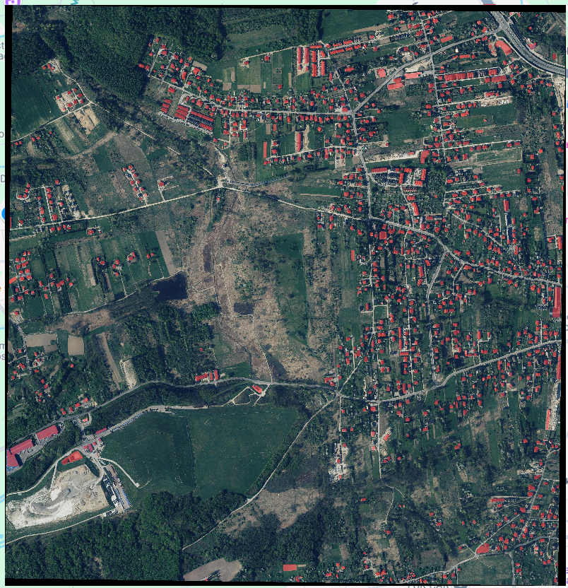
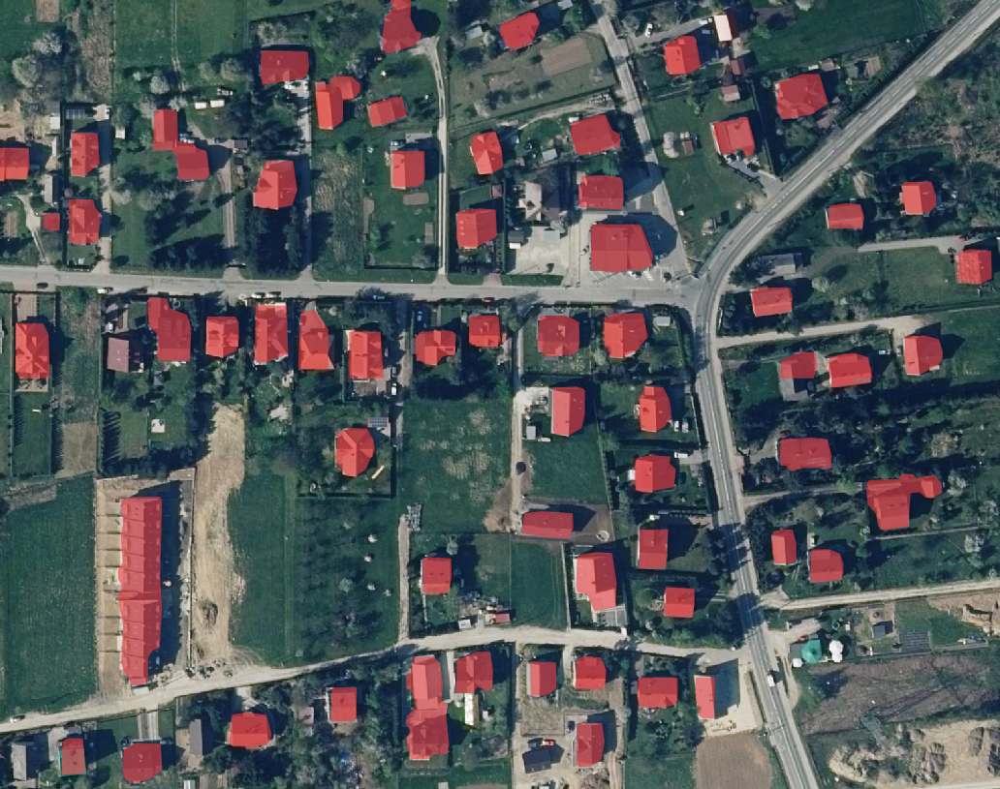

## Overview

This project is designed for building instance segmentation models using the YOLO architecture. It leverages the capabilities of the Roboflow platform for dataset management and provides a streamlined workflow for training and inference on geospatial data, specifically focusing on building detection. The input is a GeoTIFF of the location of interest, and the output is a GeoJSON file containing the recognized building masks.






## Features

- **Dataset Management:** Automatically downloads and prepares datasets from Roboflow.
- **Model Training:** Trains YOLO models with customizable parameters such as epochs, batch size, and image size.
- **Inference:** Performs inference on geospatial images, detecting and segmenting buildings.
- **Post-processing:** Includes functionality for post-processing the results, such as simplifying geometries and saving outputs in GeoJSON format.

## Installation

To set up the project, ensure you have Python 3.10. You will also need to install the required libraries. You can do this using pip:

`sudo apt install python3.10`

Also, to create a virtual environment on Ubuntu/Debian, you will need to install the following package first:

`sudo apt install -y python3.10-venv`

Some Python packages require building from source, so you may also need to install the following packages:

`sudo apt install -y build-essential libssl-dev libffi-dev python3.10-dev`

Create a virtual environment with the command:

`python3.10 -m venv venv`

Activate the virtual environment with the command in Linux (and also in macOS):

`source venv/bin/activate`

Activate the virtual environment with the command in Windows:

`venv\Scripts\activate.bat`

Activate the virtual environment with the command in Linux (and also in macOS):

`python3.10 -m pip install --upgrade pip`

To install the GDAL library on Ubuntu:

`sudo apt-get install libgdal-dev`

`export CPLUS_INCLUDE_PATH=/usr/include/gdal`

`export C_INCLUDE_PATH=/usr/include/gdal`

Install the remaining packages and extensions:

`pip install -r requirements.txt`

## How to Obtain an API Key from Roboflow

To get your Roboflow API key, follow these steps:

1. **Register on the Roboflow:** Create an account on the [Roboflow](https://roboflow.com/) if you don't have one yet.
2. **Access API Key:** Log in, go to your profile settings, generate and copy your Private API Key from the API Keys section.
3. **You are amazing!**

## Usage

### Downloading the Dataset

To download the [dataset from Roboflow](https://universe.roboflow.com/roboflow-universe-projects/buildings-instance-segmentation/dataset/4/images?split=train), you need to provide your personal API key. The dataset will be downloaded to the `datasets/` directory.

`dataset_path = download_dataset(personal_api_key)`

### Training the Model

You can train the model by calling the `train` function and passing the necessary parameters:

```
train_voc = {
    "epoch": 50,
    "batch": 16,
    "imgsz": 640,
}
results = train(api_key, train_voc)
```

### Performing Inference

To perform inference on a [GeoTIFF image](https://map.openaerialmap.org/#/20.01983642578125,50.009504166914994,14/square/1202133022113322/5d4aa5c4ad3e9500059b3815?_k=u9razn), set the `flag_predict` variable to `True` and specify the name of the GeoTIFF file:

```
flag_predict = True
name_geotiff = 'geotiff_example'
path_geotiff = transform_geotiff(name_geotiff)
inference_voc = {
    "path_geotiff": path_geotiff,
    "name_geotiff": name_geotiff,
    "task_object": {
        "task": "buildings",
        "path_weights": "weights/best.pt",
        "confidence": 0.4,
        "imgsz": 640,
    },
}
inference(inference_voc)
```

### Post-processing Results

After inference, the results can be post-processed to refine the geometries and save them in GeoJSON format. The recognized masks are assigned geospatial labels in the format 'epsg:3857'. Also, as part of the interest, a sliding window algorithm is used to improve recognition accuracy. As part of the postprocessing, the geometries are crossed, this method has allowed us to achieve high results:

```
postprocessing_geom(gdf_geom, name_geotiff, task_object, flag_save=True)
```

## Contributing

Contributions are welcome! Please feel free to submit a pull request or open an issue for any enhancements or bug fixes.

## Acknowledgments

- **Ultralytics:** For providing a powerful framework for object detection.
- **Roboflow:** For simplifying dataset management and model training.
- **Geopandas:** For handling geospatial data efficiently.

## License

This project uses Ultraytics, licensed under AGPL-3.0. For more information, please refer to the LICENSE file.
